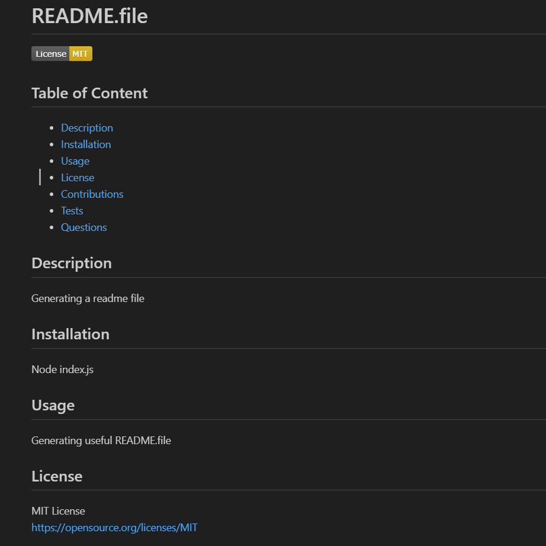

# README.file
```
Github repository below: 
https://github.com/Thaodev23/readme-file 

Screencastify video below: 
https://drive.google.com/file/d/1zyJd2qj2mX83nDjV1Zo0Xox67qf-eFza/view 
```

## User Story 
```
AS A coding bootcamp student I want to be able generate a README file using node js
SO THAT I can have a README file to use whenever and to modify however I want. 
```

## Acceptance Criteria
```
GIVEN that I have generated a README file through node js
WHEN the command line is run through the root of folder 
THEN a prompt of questions will need to be answer
WHEN prompt with a question about the description of the project
THEN the answer needs to be inputted 
WHEN prompt with a question about the installation
THEN the answer needs to be inputted
WHEN prompt with a question about the usage
THEN the answer needs to be inputted
WHEN prompt with a question about the license choice
THEN a group of license is provided as the choices to pick from
WHEN prompt with a question about the contributions
THEN the answer needs to be inputted
WHEN prompt with a question about the tests
THEN the answer needs to be inputted
WHEN prompt with a question about the username
THEN the answer needs to be inputted
WHEN prompt with a question about the email
THEN the answer needs to be inputted
WHEN all the questions are answered
THEN a README file is generated in the example folder
WHEN the README file is display
WHEN one of the section in the table of contents is clicked on
THEN the README file will be navigated to the corresponding section

```

## Image

Below: Image of an example of the generated README.file. 


## Collaborators

```
Jason Yang:
Github profile - https://github.com/Jasony95
Classmate that collaborated on the homework assignment together.
 ```

```
Sichoun Nplhaib Lee:
Github profile - https://github.com/DDXP3.
Classmate that collaborated on the homework assignment together.
```


